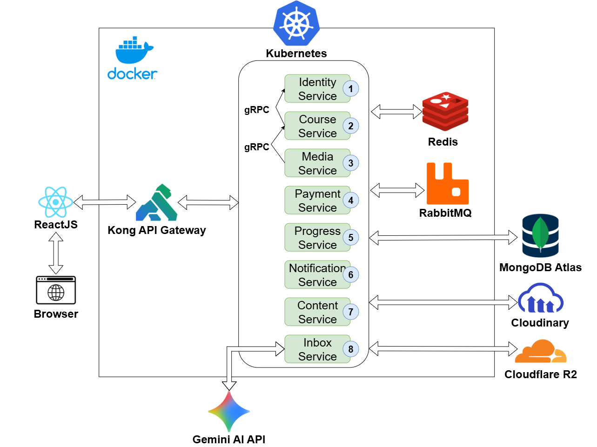
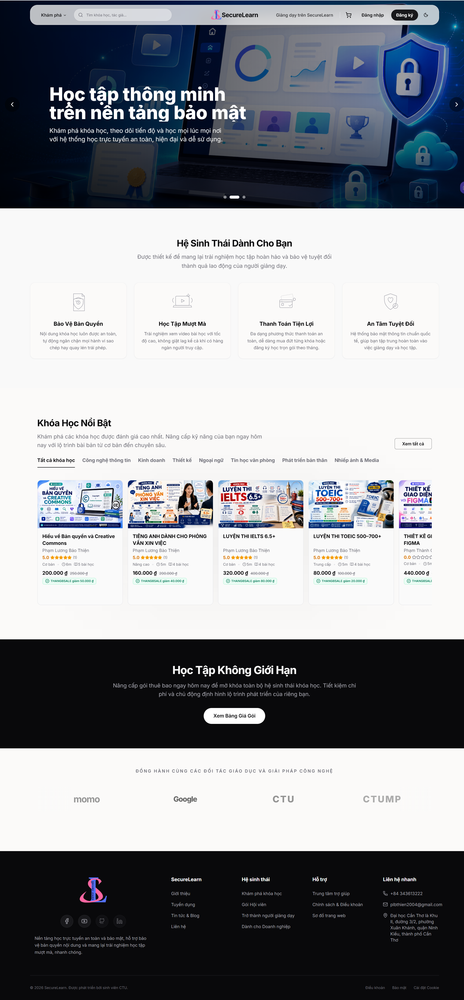
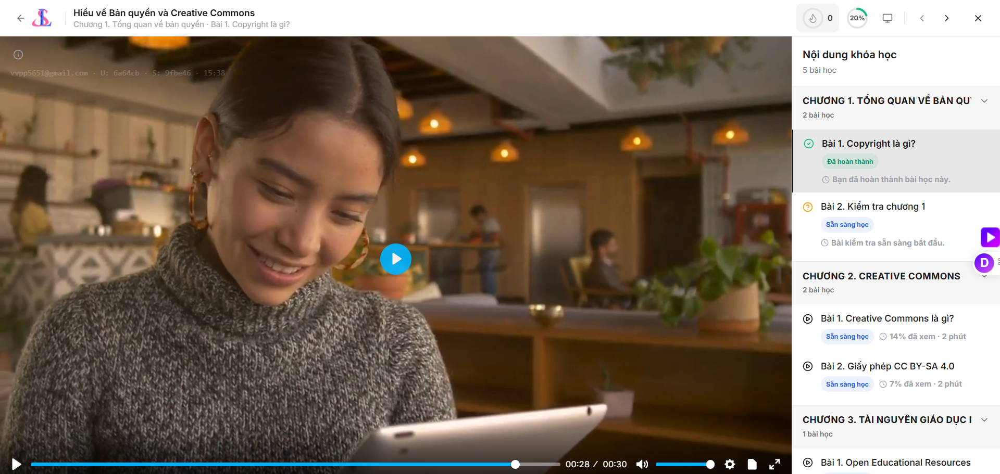
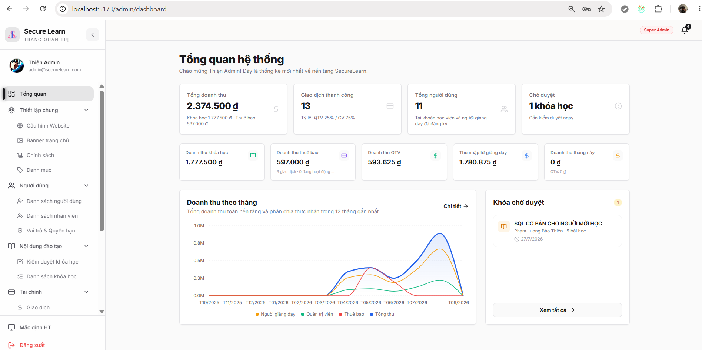

# SecureLearn

Nền tảng học trực tuyến theo kiến trúc microservices, hỗ trợ toàn bộ quy trình từ xây dựng, kiểm duyệt và kinh doanh khóa học đến học tập, thanh toán và bảo vệ nội dung số.

> **Dự án cá nhân** · 8 microservices · Frontend, backend và hạ tầng được quản lý trong ba repository riêng.

## Repository

- [SecureLearn Web](https://github.com/PhamLuongBaoThien/securelearn-web) — giao diện React cho học viên, giảng viên và quản trị viên.
- [SecureLearn Services](https://github.com/PhamLuongBaoThien/securelearn-services) — 8 microservices Node.js/Express.js.
- [SecureLearn Deploy](https://github.com/PhamLuongBaoThien/securelearn-deploy) — Kong API Gateway, Docker Compose và Helm chart.

<!-- Khi có video, thêm dòng: [▶ Xem video demo](URL_GOOGLE_DRIVE_HOAC_YOUTUBE) -->

## Kiến trúc hệ thống



Mọi request từ frontend đi qua **Kong API Gateway** trước khi được định tuyến đến service phù hợp. Các service sử dụng **gRPC** cho một số lời gọi đồng bộ, **RabbitMQ** cho sự kiện bất đồng bộ, **Redis** cho cache/session và **MongoDB Atlas** để lưu trữ dữ liệu nghiệp vụ.

## Chức năng nổi bật

- **Xác thực và phân quyền:** OTP qua email, JWT access/refresh token, Google OAuth 2.0, RBAC và quản lý phiên đăng nhập trên nhiều thiết bị.
- **Khóa học và học tập:** biên soạn giáo trình, quản lý phiên bản, gửi duyệt, ghi danh, quiz, ghi chú, thảo luận, đánh giá và theo dõi tiến độ.
- **Thanh toán:** mua khóa học hoặc gói thuê bao qua MoMo/VNPay, áp dụng coupon và quản lý giao dịch.
- **Bảo vệ video:** tải trực tiếp nhiều phần lên Cloudflare R2, chuyển mã bằng FFmpeg thành HLS ba chất lượng và mã hóa AES-128.
- **Tương tác thời gian thực:** thảo luận, thông báo và hỗ trợ trực tuyến bằng Socket.IO.
- **AI:** chatbot sử dụng Gemini API và dữ liệu khóa học nội bộ để đưa ra gợi ý phù hợp với ngữ cảnh.

## Công nghệ sử dụng

| Thành phần | Công nghệ |
| --- | --- |
| Frontend | React, TypeScript, Redux Toolkit, TanStack Query, Tailwind CSS |
| Backend | Node.js, Express.js, MongoDB, Redis, RabbitMQ, gRPC, Socket.IO |
| Gateway & triển khai | Kong API Gateway, Docker Compose, Kubernetes, Helm |
| Media | Cloudflare R2, FFmpeg, HLS, AES-128 |
| Tích hợp | Google OAuth 2.0, MoMo, VNPay, Gemini API, Cloudinary, Nodemailer |

## Giao diện tiêu biểu

### Trang chủ và danh mục khóa học



### Không gian học tập



### Trang quản trị



## Chạy dự án trên máy cá nhân

Luồng phát triển chính hiện tại là **frontend chạy bằng Vite** và **backend chạy trên Kubernetes local**:

```text
Frontend http://localhost:5173
        ↓
Kong     http://localhost:30681
        ↓
8 backend services
```

Xem hướng dẫn cài đặt, cấu hình secret, build image và triển khai tại [infra/README.md](infra/README.md).

Docker Compose được giữ làm phương án chạy thay thế:

```powershell
docker compose up -d --build
```

## Tác giả

**Phạm Lương Bảo Thiện**

- GitHub: [PhamLuongBaoThien](https://github.com/PhamLuongBaoThien)
